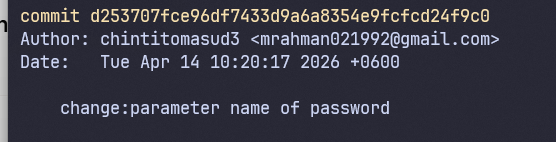

# 🎯 Assignment 02 : Enterprise-Level Git Workflow, Branching & History Management


##  🧑‍💻 Name : Masudur Rahman ,Batch:11


# 🛠️ Task 1: Repository Initialization

### Initialize Git & Rename Default Branch to Main
```
mkdir ostad_Git_Workflow
cd ostad_Git_Workflow
git init
git branch -M main
```

### Add Initial Project Structure & Commit
```

git add .
git commit -m "Initial Project structure"
````
### Create Branches
```
git branch develop
git branch feature/login
```
### Add Remote Repository
```
git remote add origin https://github.com/chintitomasud3/ostad_Git_Workflow.git
```
### Push to GitHub
```
git push -u origin main develop feature/login
```


# 🛠️ Task 2: Branching workflow
##  Create 2 feature branches from develop and bugfix/login-error from
```
git checkout -b feature/payment develop
git checkout -b feature/profile develop
git checkout -b bugfix/login-error feature/login
```

## Create content on payment and profile branch
```
git add app/payment.py
git commit -m "feat: add payment"
```
## on profile branch
```
git add app/profile.py
git commit -m "Add: add payment"
```


## Merge strategy
```
git checkout develop

git merge feature/login

```


## Rebase strategy
```
git checkout feature/profile
git rebase develop
```

## 📸 ScreenShot
## 📜 Branches


## Git merge


# 🛠️ Task 3: Commit History Managment


## Git commits on feature/login


## Interactive rebase
```
git rebase -i HEAD~5
```


# After changing of reword (rebase)


# #After squashing 
### accidently deleted the screenshot of squash command process
 


## 📘 Concept Explanations

### 🔀 Merge vs Rebase
| Feature          | `git merge`                          | `git rebase`                          |
|------------------|--------------------------------------|---------------------------------------|
| History Shape    | Creates a new merge commit           | Rewrites history for linear flow      |
| Collaboration    | Safer for shared branches            | Best for local/private feature work   |
| Conflict Handling| Resolved once at merge time          | May require resolution per commit     |
| Use Case         | Integrating `develop` ↔ `main`       | Cleaning up feature branch before PR  |

### 🧼 Squash & Reword
- **Squash**: Combines multiple related commits into a single, meaningful commit. Reduces noise in `git log` and simplifies code review.
- **Reword**: Modifies only the commit message without changing the snapshot. Used to fix typos, add context, or align with conventional commit standards.

