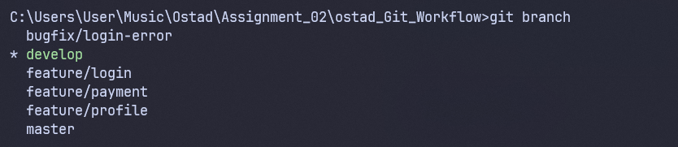
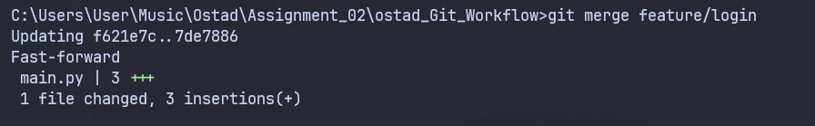
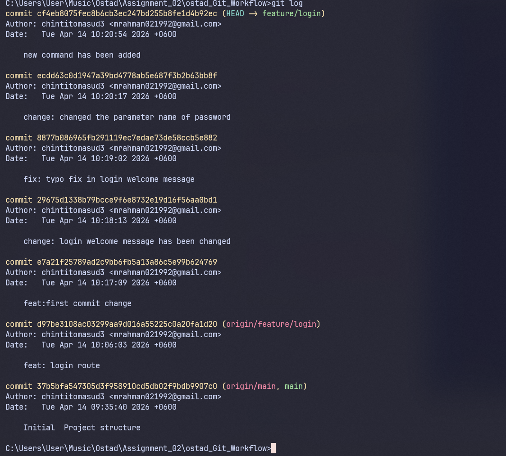
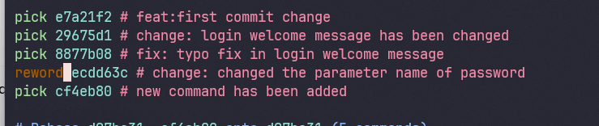

# Task 1: Repository Initialization

### Initialize Git & Rename Default Branch to Main
```
mkdir ostad_Git_Workflow
cd ostad_Git_Workflow
git init
git branch -M main
```

### Add Initial Project Structure & Commit
```

git add .
git commit -m "Initial Project structure"
````
### Create Branches
```
git branch develop
git branch feature/login
```
### Add Remote Repository
```
git remote add origin https://github.com/chintitomasud3/ostad_Git_Workflow.git
```
### Push to GitHub
```
git push -u origin main develop feature/login
```


# Task 2: Branching workflow
##  Create 2 feature branches from develop and bugfix/login-error from
```
git checkout -b feature/payment develop
git checkout -b feature/profile develop
git checkout -b bugfix/login-error feature/login
```

## Create content on payment and profile branch
```
git add app/payment.py
git commit -m "feat: add payment"
```
## on profile branch
```
git add app/profile.py
git commit -m "Add: add payment"
```


## Merge strategy
```
git checkout develop

git merge feature/login

```


## Rebase strategy
```
git checkout feature/profile
git rebase develop
```

## ScreenShot
## Branches



## Git merge



# Task 3: Commit History Managment


## Git commits on feature/login


## Interactive rebase
```
git rebase -i HEAD~5
```

